# SkillNest — Online Course Marketplace

A full-featured course marketplace built on **Laravel 12**, **Blade**, **AlpineJS**, and **Tailwind CSS v4**. The platform supports three distinct user roles — student, instructor, and administrator — with a complete payment pipeline powered by Stripe Checkout and Stripe Connect.

---

## Table of Contents

- [Overview](#overview)
- [Feature Set](#feature-set)
- [Tech Stack](#tech-stack)
- [Architecture](#architecture)
- [Installation](#installation)
- [Development](#development)
- [Testing](#testing)
- [License](#license)

---

## Overview

Learnify is a production-oriented learning marketplace covering the full lifecycle of an online course platform: content creation, discovery, purchase, consumption, and certification. The application is intentionally built without a JavaScript framework on the frontend — Blade components, AlpineJS, and server-side rendering handle all UI concerns cleanly and efficiently.

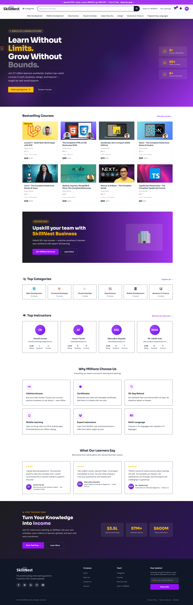

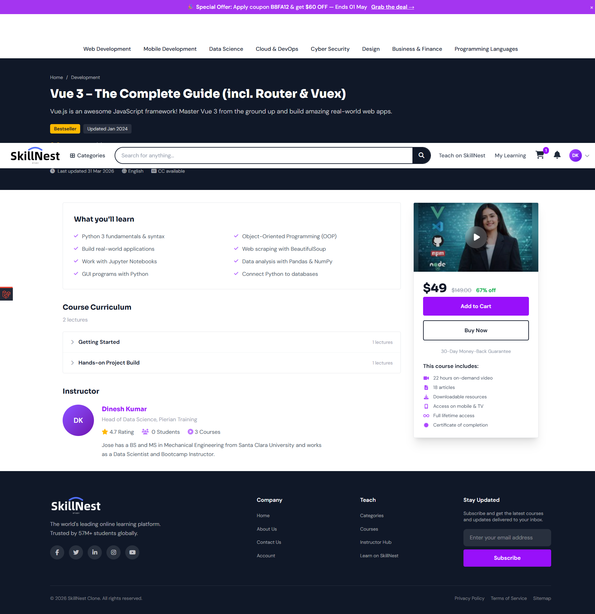
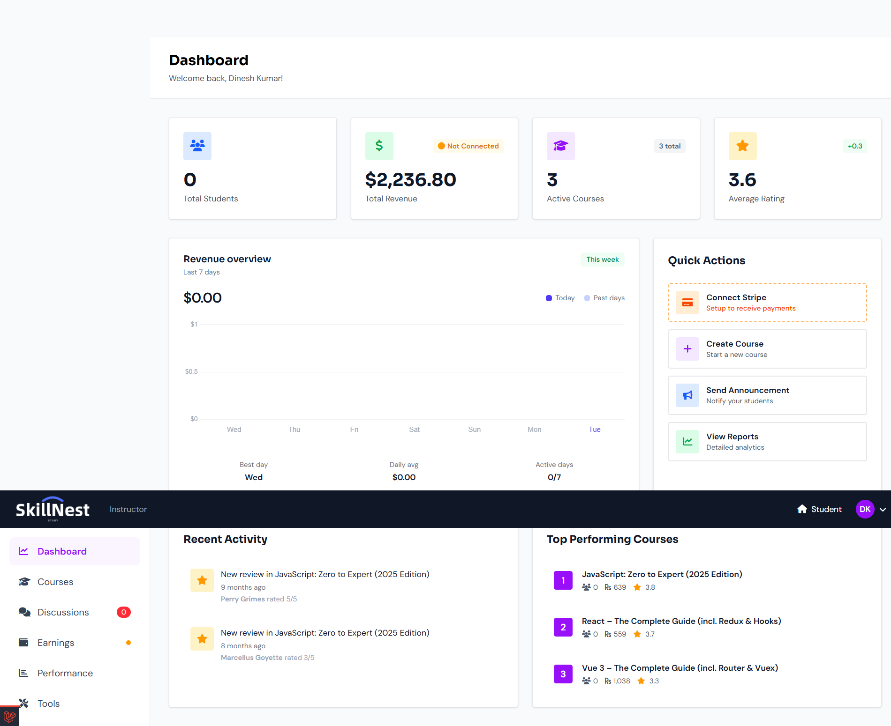
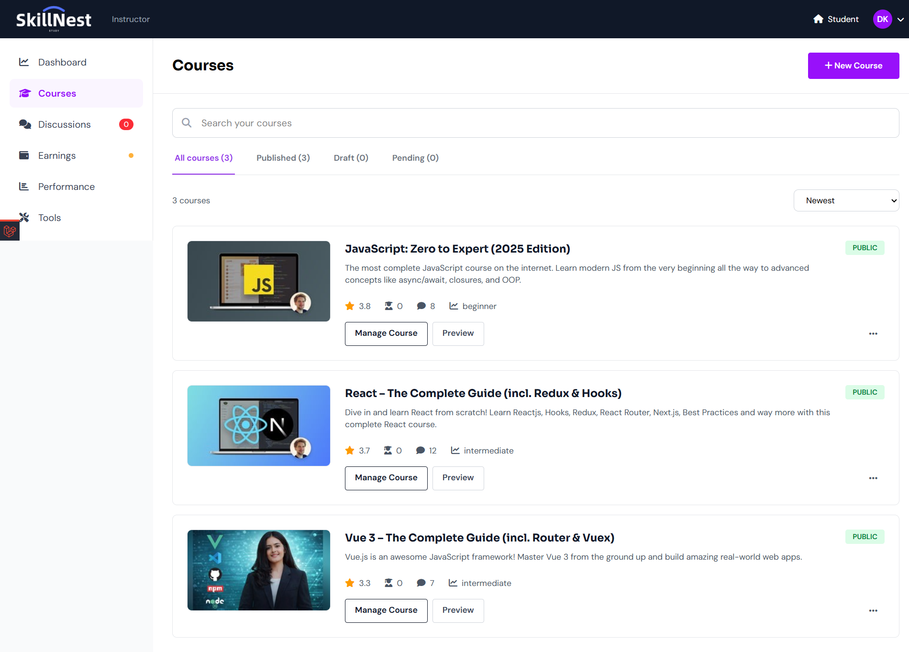
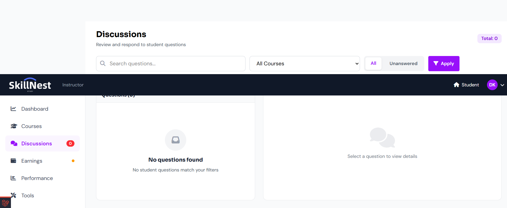
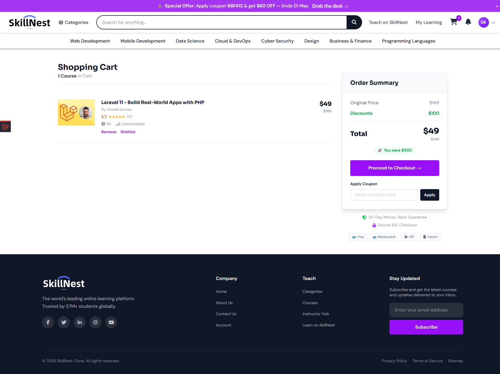
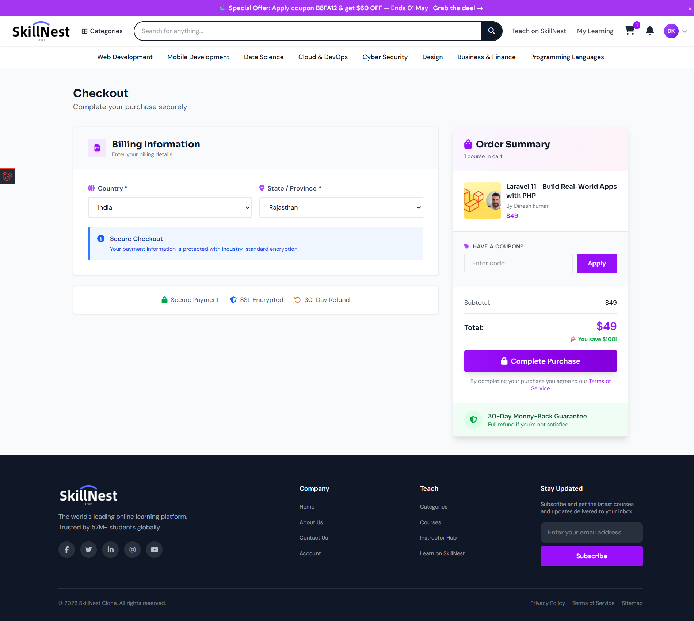
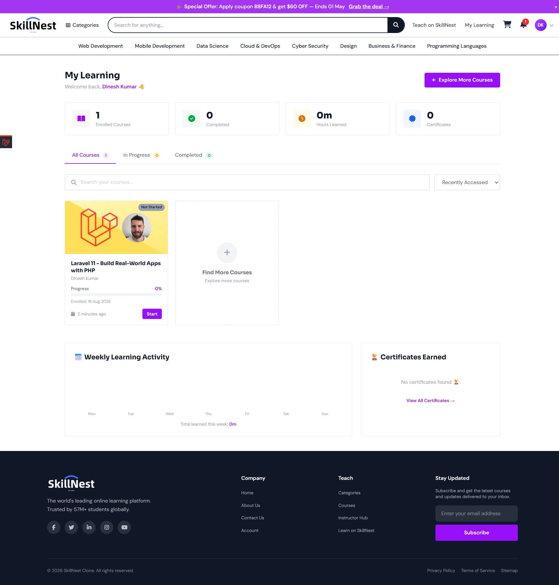
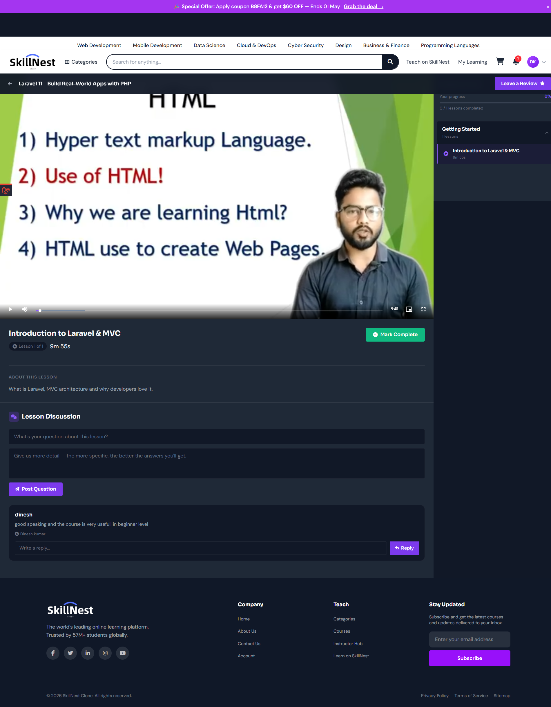
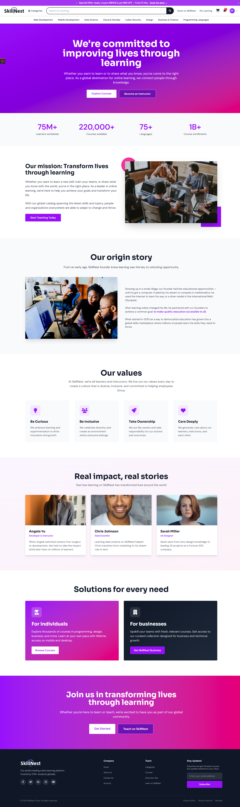
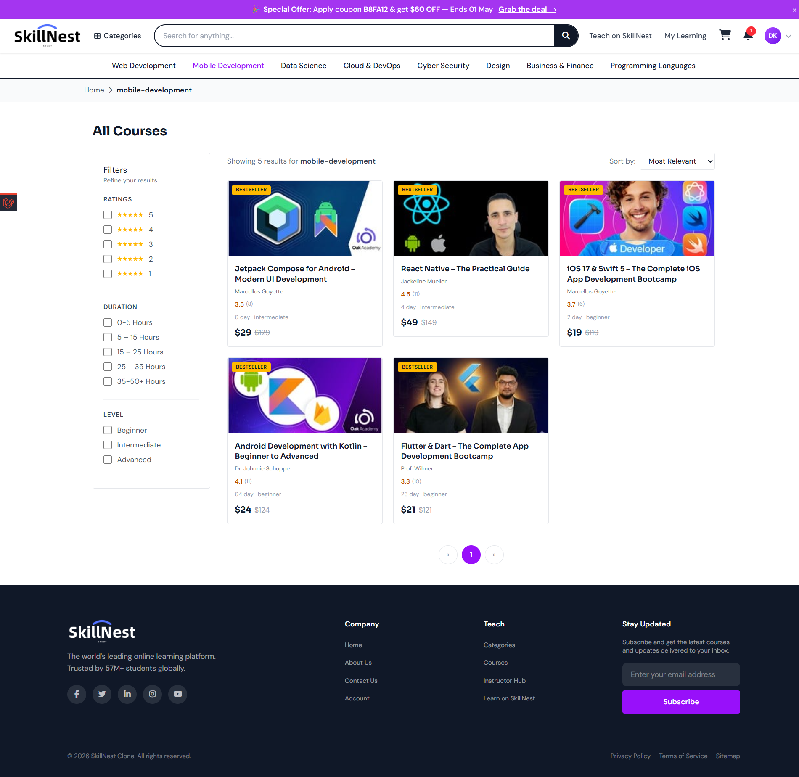


---

## Feature Set

### Student

- Course discovery with full-text search and category filtering
- Course detail pages with preview lessons, instructor profiles, ratings, and enrollment status
- Cart, wishlist, and coupon application
- Stripe-powered checkout with webhook-driven enrollment confirmation
- Learning dashboard with per-lesson progress tracking
- Downloadable completion certificates (PDF)
- Course reviews and threaded discussion participation
- In-app notification system

### Instructor

- Dedicated instructor dashboard behind protected route middleware
- Stripe Connect onboarding for direct payouts
- Course and lesson authoring with media upload support
- Discussion management and student reply workflow
- Course engagement statistics

### Admin

- Role-based admin panel using Spatie Permission
- Full CRUD management across users, courses, lessons, enrollments, reviews, certificates, categories, coupons, contacts, and newsletters
- Course data import and export via Maatwebsite Excel
- Newsletter and contact form response management

### Platform

- Laravel authentication with email verification and password reset
- Google OAuth via Laravel Socialite
- Stripe webhook handler for payment reconciliation
- Course progress and lesson completion tracking
- Cache-optimised home page (top categories, instructors, featured courses)
- Soft deletes across core models
- Full-text search indexing with Typesense via Laravel Scout

---

## Tech Stack

| Layer | Technology |
|---|---|
| Language | PHP 8.5 |
| Framework | Laravel 12 |
| Frontend | Blade, AlpineJS, Tailwind CSS v4 |
| Build tooling | Vite |
| Database | MySQL / SQLite |
| Search | Typesense (via Laravel Scout) |
| Payments | Stripe Checkout, Stripe Connect, Laravel Cashier |
| Auth | Laravel Socialite (Google OAuth) |
| Media | Spatie Media Library |
| PDF / Certificates | Spatie Laravel PDF, Browsershot |
| Video | pbmedia Laravel FFmpeg |
| Roles & Permissions | Spatie Laravel Permission |
| Import / Export | Maatwebsite Excel |
| Icons | Blade FontAwesome, Blade UI Kit |

---

## Architecture

The application follows conventional Laravel conventions with a few deliberate patterns applied consistently across the codebase.

**Controllers** are kept thin. HTTP-layer concerns (request validation via Form Requests, response formatting, redirects) are handled in controllers. Business logic is delegated to dedicated service classes.

**Service classes** encapsulate domain operations that span multiple models or require external service coordination — for example, `StripeConnectService` manages Connect account lifecycle, `CourseService` handles enrollment side effects, and `ContactService` owns the contact/newsletter workflow.

**Policies** govern authorisation at the model level. Route middleware handles coarse-grained role checks (admin, instructor, student), while policies handle fine-grained ownership and permission rules.

**Models** expose scopes and relationships to keep query logic co-located with the data they describe. Controllers consume scoped queries rather than constructing them inline.

**Blade components and partials** are used for all recurring UI patterns — course cards, lesson rows, modals, form inputs — keeping views composable and avoiding duplication.

**Route organisation** uses named route groups with shared middleware stacks per role, making the routing table easy to audit.

---

## Installation

> Requires PHP 8.5+, Composer, Node 18+, and a running MySQL or SQLite instance.

```bash
git clone https://github.com/your-username/skillnest.git
cd skillnest

composer install
cp .env.example .env
php artisan key:generate
```

Configure your database, Stripe keys, and Google OAuth credentials in `.env`, then:

```bash
php artisan migrate --seed
npm install
npm run build
```

For local development using the Vite dev server:

```bash
npm run dev
php artisan serve
```

> **Windows (PowerShell):** replace `cp` with `copy` in the commands above.

---

### Required environment variables

```env
# Database
DB_CONNECTION=mysql
DB_DATABASE=learnify

# Stripe
STRIPE_KEY=pk_test_...
STRIPE_SECRET=sk_test_...
STRIPE_WEBHOOK_SECRET=whsec_...

# Google OAuth
GOOGLE_CLIENT_ID=...
GOOGLE_CLIENT_SECRET=...
GOOGLE_REDIRECT_URI=http://localhost:8000/auth/google/callback

# Typesense
TYPESENSE_API_KEY=...
TYPESENSE_HOST=localhost
```

---

## Development

| Command | Description |
|---|---|
| `php artisan serve` | Start the local development server |
| `npm run dev` | Start the Vite HMR dev server |
| `npm run build` | Compile and bundle production assets |
| `php artisan migrate` | Run pending database migrations |
| `php artisan db:seed` | Seed the database with demo data |
| `php artisan scout:import "App\Models\Course"` | Index courses into Typesense |
| `php artisan queue:work` | Start the queue worker (for mail and media jobs) |

---

## Testing

```bash
php artisan test --compact
```

Tests cover core flows including enrollment, payment webhooks, and role-based access control.

---

## License

This project is open-sourced under the [MIT License](LICENSE).